# Diário de Bordo — Projeto Flutter (Faculdade)

Este repositório é o registro de tudo que vamos fazendo no projeto Flutter da
faculdade (`flutter_dart`): decisões tomadas, comandos rodados, prompts usados
com IA e prints das telas. A ideia é ir anotando aqui no dia a dia; depois dá
pra transformar isso num template mais bonito.

Cada entrada nova fica em ordem cronológica (mais recente por último), com
data, o que foi feito, como foi feito (incluindo uso de IA) e, quando possível,
imagem.

---

## 25/08 e 26/08/2026

**O que foi feito:** criação do repositório `flutter_dart` no GitHub e
configuração da proteção da branch `main`, antes de qualquer código entrar
no projeto.

**Como foi feito:**
- Criei o repositório `flutter_dart` na conta `Pedro-Martins-Nascimento`
  (público, sem README/gitignore automáticos).
- Fiz o primeiro commit do projeto pelo VS Code ("setup inicial do
  projeto Flutter").
- Configurei o `.gitignore` pra não versionar arquivos sensíveis do
  Firebase (`android/app/google-services.json`,
  `ios/Runner/GoogleService-Info.plist`, `lib/firebase_options.dart`),
  já preparando pra quando a integração com Firebase entrar na N2.
- Criei uma **ruleset** (`main-protection`) pra branch `main`, em vez da
  branch protection clássica:
  - exige Pull Request antes de qualquer merge (sem push direto);
  - exige 1 aprovação de review antes de mergear;
  - permite só **squash merge** (desabilita merge commit e rebase);
  - bloqueia force push e restringe quem pode apagar a branch.

**Resultado:** repositório criado e protegido desde o início — toda
mudança na `main` passa obrigatoriamente por PR revisada. Essa regra
acabou travando alguns merges nos dias seguintes (ver entrada de
04/09/2026), mas era exatamente o comportamento configurado aqui.

**Imagens:**

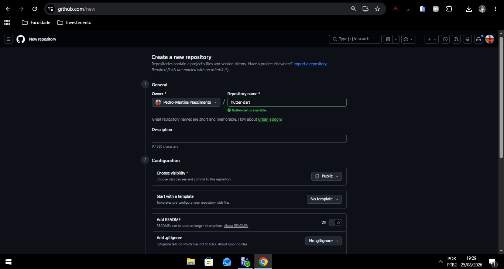
*Criação do repositório no GitHub*

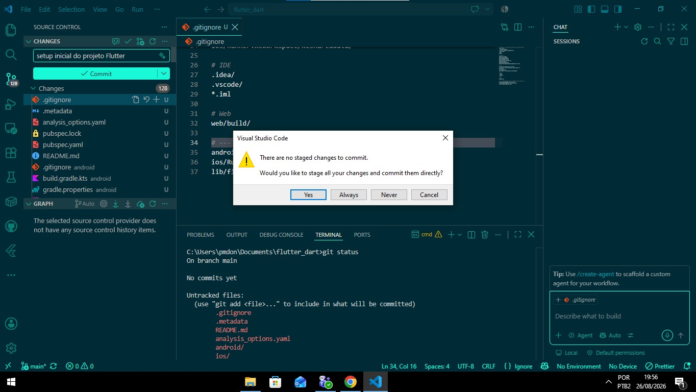
*Primeiro commit pelo VS Code*

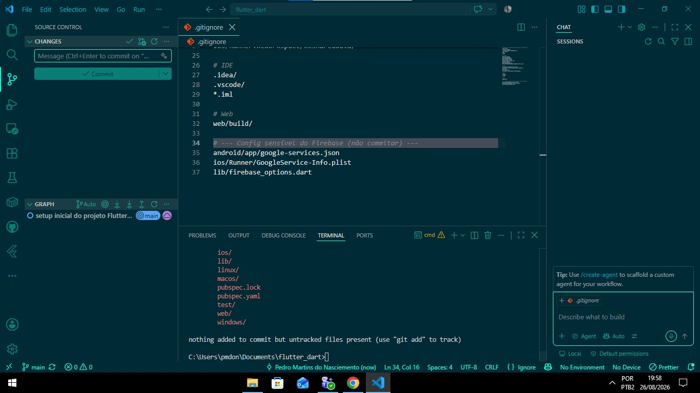
*`.gitignore` com exclusão da config sensível do Firebase*

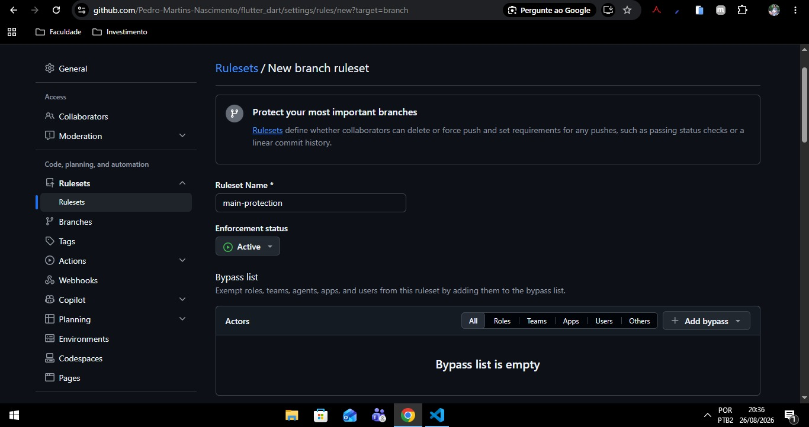
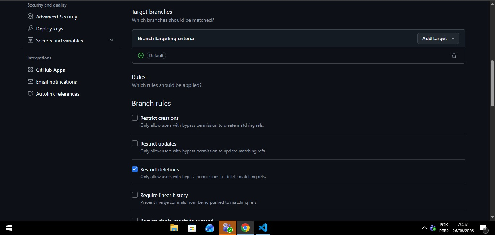
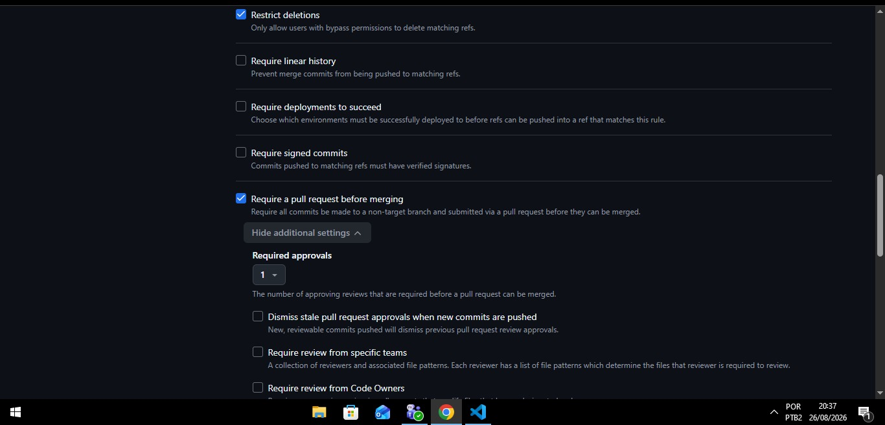
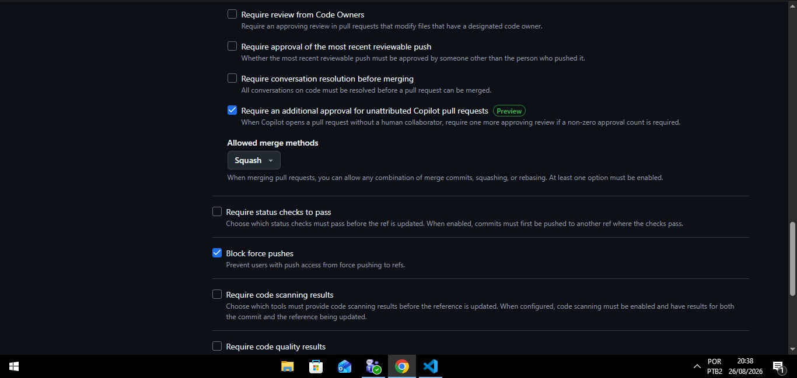
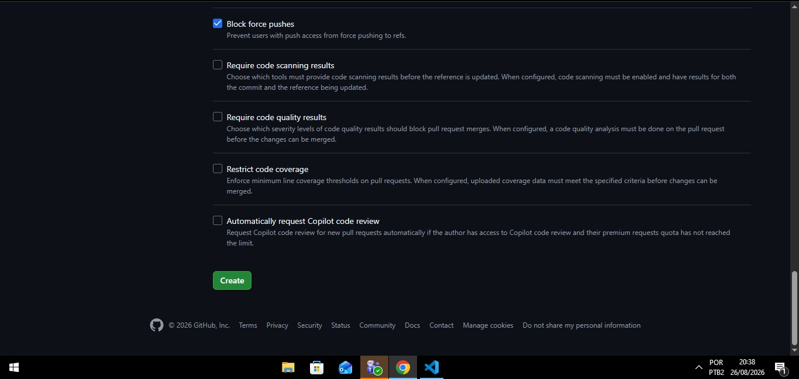
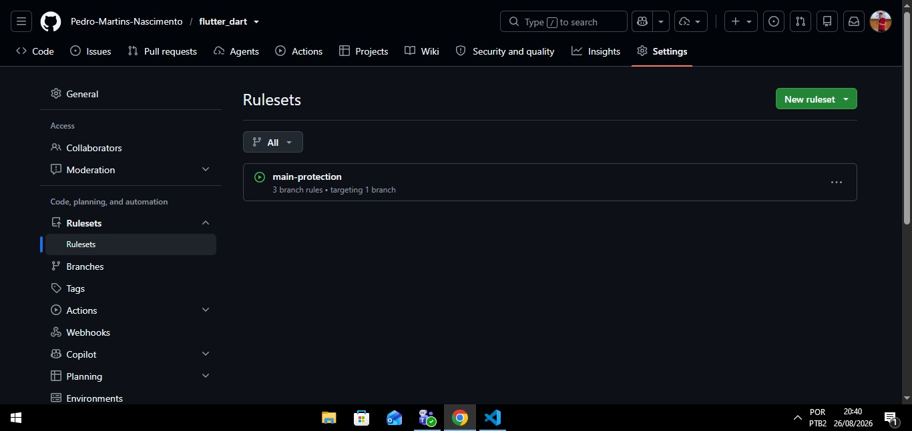
*Passo a passo da criação da ruleset `main-protection` (PR obrigatória, 1
aprovação, squash-only, bloqueio de force push)*

---

## 29/08/2026

**O que foi feito:** limpeza geral do projeto Flutter recém-criado
(`flutter_dart`), que estava com a estrutura padrão gerada pelo
`flutter create`.

**Como foi feito:**
- Usei o Claude Code (assistente de IA) para revisar o repositório.
- Rodei `flutter analyze` e `flutter test` pra confirmar que o projeto padrão
  não tinha nenhum erro antes de mexer em qualquer coisa.
- Pedi para remover os comentários de tutorial que o Flutter gera
  automaticamente em `lib/main.dart`, `test/widget_test.dart` e
  `pubspec.yaml`, mantendo só o código funcional.
- Atualizei a descrição do `pubspec.yaml` e o `README.md` do projeto
  (`flutter_dart`) para refletir que é um projeto da faculdade.
- Rodei `flutter analyze` e `flutter test` de novo depois das mudanças pra
  garantir que nada quebrou.

**Resultado:** projeto `flutter_dart` mais limpo, sem comentários de
boilerplate, com `flutter analyze` e `flutter test` passando 100%.

**Imagens:**

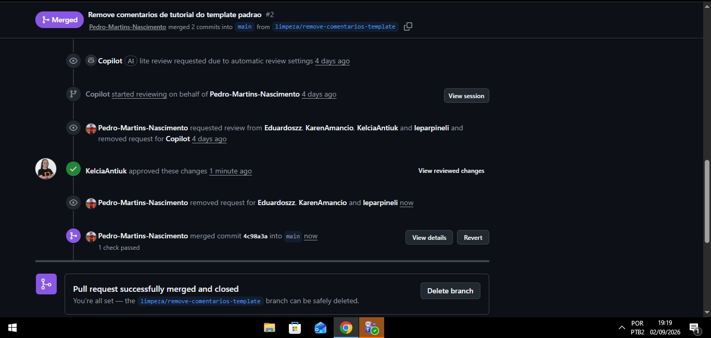
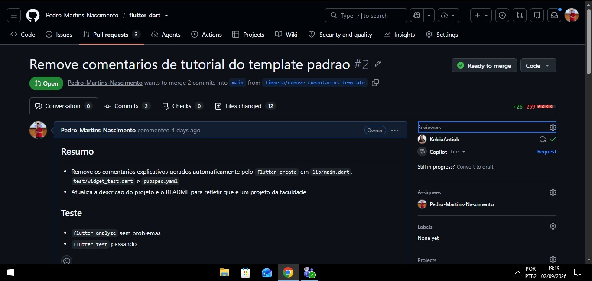
*Merge da PR #2, que entregou essa limpeza (os prints são de 02/09; o
trabalho local foi feito em 29/08, mas a PR só foi mergeada no GitHub
alguns dias depois)*

---

## 03/09/2026

**O que foi feito:** análise das Pull Requests abertas no repositório
`flutter_dart` para decidir a estratégia de merge (mergear tudo e depois
padronizar componentes, ou pedir pra cada pessoa arrumar antes de mergear).
Só análise — nenhuma PR foi mergeada ou alterada.

**Como foi feito:**
- Usei o Claude Code (assistente de IA) para listar e inspecionar as PRs
  abertas com `gh pr list` e `gh pr view <n> --json ...`.
- Comparei os branches com `git log origin/main..origin/<branch> --oneline`
  pra entender a cadeia de dependência entre as PRs.
- Simulei os merges com `git merge-tree $(git merge-base origin/main
  origin/feature/tela-provas) origin/main origin/feature/tela-provas` pra
  achar a causa exata do conflito, sem precisar fazer checkout de nada.

**Evidência (logs do git):**
```
$ gh pr list --state open
#5  Feature/main shell   feature/main-shell -> feature/tela-login   MERGEABLE
#4  Tela-Login           feature/tela-login -> feature/tela-provas  MERGEABLE
#3  banco de questoes... feature/questoes   -> main                CONFLICTING
#1  feat(provas)...      feature/tela-provas -> main               CONFLICTING

$ git log origin/main..origin/feature/tela-provas --oneline
29cb9dc feat(provas): fluxo completo de Criar Prova, Gerar Provas e exportação em PDF

$ git log origin/feature/tela-provas..origin/feature/questoes --oneline
38c9244 feat(questoes): banco de questoes com alternativas e gabarito

$ git log origin/feature/tela-provas..origin/feature/tela-login --oneline
8e93729 feat: added login
ce7f49a added new route
f5ed203 remove debug and update comment

$ git log origin/feature/tela-login..origin/feature/main-shell --oneline
256bd32 feat: added em breve
7336950 feat: added bottom nav
0ad62d5 feat: added main shell
daa19df feat: new routes
```
O `git merge-tree` mostrou que o conflito de #1 e #3 é só em `lib/main.dart`:
a limpeza de comentários já feita em `main` (commit `4c98a3a`) mexeu no mesmo
trecho que a #1 reescreveu para usar `MaterialApp.router`.

**Resultado / decisão:** as PRs não são independentes, formam uma cadeia:
`main` ← `tela-provas` (#1) ← `tela-login` (#4) ← `main-shell` (#5), com
`questoes` (#3) derivada de `tela-provas` mas mirando `main` direto (por
isso já carrega o commit da #1 dentro dela). Também achei uma branch órfã
`feature/tela-turmas` sem PR aberta.

Decidido: mergear na ordem certa primeiro (resolvendo o único conflito
pontual do `main.dart`) e só depois abrir uma tarefa de padronização de
componentes (tema, cards, navegação) — em vez de pedir pra cada autor
arrumar em paralelo, o que geraria mais rebase e mais conflito com os
branches se movendo. Ordem definida:
1. Resolver conflito de `main.dart` e mergear #1 (`tela-provas`).
2. Reapontar #3 (`questoes`) pra `main` e mergear.
3. Reapontar #4 (`tela-login`) pra `main` e mergear.
4. Reapontar #5 (`main-shell`) pra `main` e mergear.
5. Abrir PR única de padronização em cima do que já estiver consolidado.

**Também nesse dia:** aprovada a PR #6 (`docs: register project decisions
and notes`), que organizou a documentação do projeto em
`docs/correcao-de-provas-docs.md` — levantamento do cliente, RFs/RNFs,
fases N1/N2/N3 e o protótipo visual em HTML (`docs/appProvas.html`) — e
que serviu de base pra este diário de bordo.

**Imagens:**

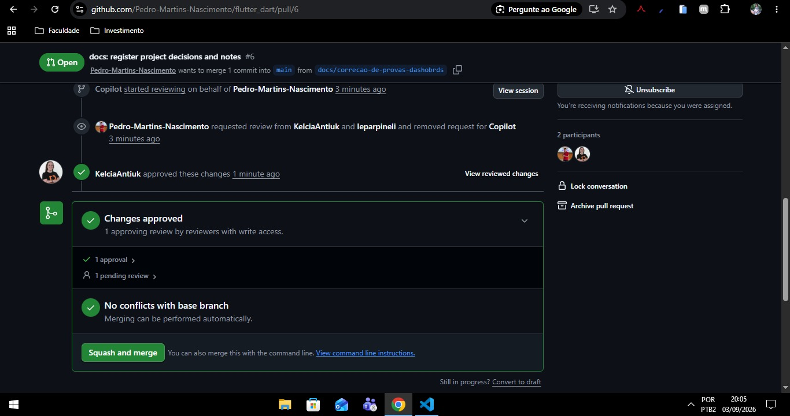
*PR #6 aprovada por `KelciaAntiuk`, pronta pra squash merge*

---

## 04/09/2026

**O que foi feito:** merge das PRs abertas do `flutter_dart` (banco de
questões, login e main-shell) seguindo a ordem decidida no dia 03/09,
resolvendo os conflitos reais encontrados no caminho.

**Como foi feito:**
- Usei o Claude Code para trocar a conta ativa do GitHub CLI
  (`gh auth switch`) para a conta dona do repositório
  (`Pedro-Martins-Nascimento`) antes de mexer nas PRs.
- Mergeei a PR #4 (Tela-Login) com `gh pr merge --merge`. Só depois percebi
  que a PR estava aberta contra `feature/tela-provas` como base (não
  `main`) — o merge foi real, mas não chegou na `main` diretamente. Isso
  também fechou a PR #5 sozinha, porque o GitHub fecha automaticamente
  uma PR quando a branch base dela é apagada (e o `--delete-branch` do
  merge da #4 apagou `feature/tela-login`, que era a base da #5).
- Recriei a PR #5 como uma nova PR (#7), agora com base certa (`main`).
  Como a branch `feature/main-shell` já continha os commits do login (era
  empilhada em cima de `feature/tela-login`), o conteúdo do login acabou
  chegando na `main` por essa PR mesmo assim.
- Resolvido o conflito de merge entre `feature/main-shell` e `main` em
  `lib/main.dart` e `lib/router/app_router.dart` — histórico divergente,
  já que `feature/main-shell` foi criada antes do squash-merge da PR #1.
  Mantida a versão mais completa (login + shell com bottom nav + rotas de
  provas).
- Atualizei o smoke test (`test/widget_test.dart`), que checava a tela de
  Criar Prova como tela inicial — ele já tinha um TODO anotado pra isso,
  então troquei pra verificar a tela de Login.
- Resolvido o conflito da PR #3 (banco de questões) em 5 arquivos
  (`app_router.dart`, `criar_prova_screen.dart`, `gerar_provas_screen.dart`,
  `preview_layout_screen.dart`, `pdf_service.dart`). Comparei os dois lados
  do conflito com `git diff origin/main:<arquivo> feature/questoes:<arquivo>`
  e confirmei que a versão da branch `feature/questoes` era uma evolução
  da que já estava na `main` (trocava os dados mock pelo modelo `Questao`
  real, com alternativas e gabarito) — então mantive essa versão.
- Rodei `flutter analyze` e `flutter test` depois de cada merge de
  conflito, antes de subir (`git push`), pra garantir que nada quebrou.
- Descobri que o repositório tem uma **ruleset** na `main` exigindo 1
  review aprovada e permitindo só squash merge — nem `gh pr merge --admin`
  contorna isso. Pedi review pra `KelciaAntiuk` nas PRs #7 e #3.
- Cheguei a criar uma PR de diário de bordo dentro do próprio repositório
  `flutter_dart` (`docs/diario-de-bordo.md`), mas o diário de bordo é essa
  pasta local mesmo — fechei a PR e apaguei o arquivo/branch de lá.

**Resultado:** PRs #7 (main-shell + login) e #3 (banco de questões)
prontas e validadas (`flutter analyze` sem apontamentos, `flutter test`
passando), aguardando review aprovada pra mergear com squash. PR #4 ficou
registrada como "merged" no GitHub, mas mergeada em `feature/tela-provas`
em vez de `main` — sem efeito prático, porque o conteúdo dela chega na
`main` de qualquer forma pela #7, mas fica esse detalhe no histórico do
GitHub pra quem for conferir depois.

**Pendente:**
- Aguardar aprovação de `KelciaAntiuk` e mergear `#7` e depois `#3` (nessa
  ordem, via squash).
- Revalidar `#3` contra a `main` depois que `#7` for mergeada (as duas
  mexem em `app_router.dart`, pode surgir conflito novo).

**Imagens:** _(adicionar prints em `imagens/2026-09-04/` quando tiver)_

---

## 08/09/2026

**O que foi feito:** troca da conta ativa do GitHub CLI, merge da PR #9
(`feature/tela-provas`) na `main`, e início da análise da PR #3 (banco de
questões), que foi interrompida por ter um conflito de lógica de negócio
real — decisão de como resolver ficou pendente.

**Como foi feito:**
- Usei o Claude Code para trocar a conta ativa do `gh` de `pedron-martins`
  para `Pedro-Martins-Nascimento` (`gh auth switch`), dona do repositório
  `flutter_dart`.
- Revisei a PR #9 (`feature/tela-provas` → `main`, autora `KarenAmancio`):
  fiz checkout, mergeei `main` na branch e resolvi um conflito pontual em
  `lib/router/app_router.dart` (a branch ainda tinha rotas soltas de
  `/criar-prova` e `/gerar-provas` fora do shell; a `main` já tinha
  migrado essas rotas pra dentro da `StatefulShellRoute` com bottom nav —
  mantive a estrutura de shell da `main` e preservei o tratamento de
  `ProvaGerada`/histórico que a PR trazia).
- Rodei `flutter analyze` (sem apontamentos) e `flutter test` (1/1
  passando) depois do merge, antes de subir.
- Tentei `gh pr merge --merge` e esbarrei de novo na ruleset da `main`
  (ver 25/08): exige review aprovada. Diferente do dia 04/09, dessa vez
  aprovei a PR eu mesmo pelo `gh pr review --approve` (com o resultado da
  validação no corpo da aprovação) antes de mergear.
- `gh pr merge --merge` falhou de novo, mas com um motivo novo: "Merge
  commits are not allowed on this repository" — a ruleset permite **só
  squash merge** (como já estava documentado na entrada de 25/08, mas eu
  tinha esquecido na hora). Troquei pra `gh pr merge --squash` e mergeou.
- Comecei a mesma sequência na PR #3 (`feature/questoes` → `main`, autor
  `Eduardo`): atualizei a `main` local (trouxe o squash da #9) e dei
  `gh pr checkout 3` + merge da `main` na branch.
- O merge da PR #3 gerou conflito real (não só cosmético) em 5 arquivos:
  `app_router.dart`, `criar_prova_screen.dart`, `gerar_provas_screen.dart`,
  `preview_layout_screen.dart` e `pdf_service.dart`. A causa: a `main`
  (via PR #9) evoluiu "Criar Prova" com nome da prova, seleção de turma e
  histórico de provas geradas (`DadosProva`), enquanto a `feature/questoes`
  trocou o banco mock simples por um modelo real em `lib/models/questao.dart`
  (`Questao` com `alternativas` e `respostaCorreta`, banco com 8 matérias e
  48 questões) e passou a montar o PDF com o conteúdo real das questões em
  vez do texto placeholder que a `main` ainda usava.
- Cheguei a montar uma proposta de resolução (unir o modelo real de
  questões da #3 com a UI de turma/nome/histórico da #9), mas fui
  interrompido antes de aplicar — recebi instrução pra não mexer mais na
  PR #3 por agora e priorizar esse registro no diário.
- Abortei o merge em andamento (`git merge --abort`) na branch
  `feature/questoes` pra não deixar a branch remota nem o repositório
  `flutter_dart` com nada pela metade.

**Resultado:** PR #9 mergeada na `main` (squash). PR #3 segue aberta e
sem alterações — o merge de teste foi desfeito, o conflito real entre os
dois modelos de questões (mock simples com turma/nome vs. modelo real com
alternativas/gabarito) ainda precisa ser decidido antes de retomar.

**Pendente:**
- Decidir e aplicar a resolução do conflito da PR #3 (levar o modelo real
  de `models/questao.dart` para dentro da tela que já tem nome da
  prova/turma/histórico, sem perder nem o banco de questões novo nem a UI
  já consolidada).
- Revalidar com `flutter analyze` e `flutter test` depois da resolução.
- Só commitar/mergear a #3 depois dessa decisão — sem abrir PR nova, como
  combinado.

**Imagens:** _(adicionar prints em `imagens/2026-09-08/` quando tiver)_

---

<!--
Modelo para novas entradas — copiar e preencher:

## DD/MM/AAAA

**O que foi feito:**

**Como foi feito:**

**Resultado:**

**Imagens:**
-->
